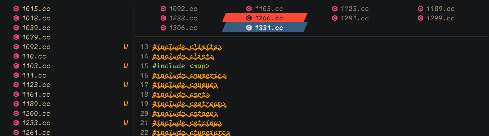

<h1 align="center">
  bufferline.nvim
</h1>

一个为 Neovim 打造的 <i>时髦</i> 💅 buffer 行（含标签页集成），使用 <b>lua</b> 编写。

本项目基于 [akinsho/bufferline.nvim](https://github.com/akinsho/bufferline.nvim)，
新增 **[多行 buffer 标签](#多行-buffer-标签)**：在编辑区上方自动换行，同时展示更多已打开的
buffer，并为侧边栏保留空间。原生单行模式仍是默认选项。

原有的单行体验依然保留：

  <a href="https://github.com/MOSconfig/bufferline.nvim/wiki/zh-CN-Home">中文文档 wiki</a> ·
  <a href="README.md">English</a> ·
  <a href="AGENTS.md">AI agent 指南</a>

<!--toc:start-->

- [环境要求](#环境要求)
- [安装](#安装)
- [使用](#使用)
- [配置](#配置)
- [功能](#功能)
  - [多行 buffer 标签](#多行-buffer-标签)
  - [其他样式](#其他样式)
  - [悬停事件](#悬停事件)
  - [下划线指示器](#下划线指示器)
  - [标签页](#标签页)
  - [LSP 指示器](#lsp-指示器)
  - [分组](#分组)
  - [侧边栏偏移](#侧边栏偏移)
  - [编号](#编号)
  - [拾取](#拾取)
  - [固定](#固定)
  - [唯一名称](#唯一名称)
  - [关闭图标](#关闭图标)
  - [重新排序](#重新排序)
  - [自定义区域](#自定义区域)
- [如何按标签页只显示对应的 buffer？](#如何按标签页只显示对应的-buffer)
- [注意事项](#注意事项)
- [常见问题](#常见问题)
- [测试](#测试)
<!--toc:end-->

本插件毫不掩饰地尝试模仿 GUI 文本编辑器／Doom Emacs 的美学，灵感来自一张使用
[centaur tabs](https://github.com/ema2159/centaur-tabs) 的 DOOM Emacs 截图。

完整文档位于 [wiki](https://github.com/MOSconfig/bufferline.nvim/wiki/zh-CN-Home)，它是
唯一的文档撰写来源。Vim 帮助文件由其生成并随仓库分发——使用 `:help bufferline.nvim` 阅读。

## 环境要求

- Neovim 0.8+（[多行 buffer 标签](#多行-buffer-标签)需要 0.12+）
- 一款补丁字体（参见 [nerd fonts](https://github.com/ryanoasis/nerd-fonts)）
- 一款配色方案（自定义高亮，或任意维护良好的方案）

## 安装

使用多行标签请安装本 fork。插件管理器示例与版本选择说明见
[安装与使用](https://github.com/MOSconfig/bufferline.nvim/wiki/zh-CN-Installation-and-Usage)。

## 使用

配置示例与鼠标操作见
[安装与使用](https://github.com/MOSconfig/bufferline.nvim/wiki/zh-CN-Installation-and-Usage)。
完整离线参考手册可通过 `:help bufferline.nvim` 阅读。

## 配置

`setup()` 接收一份**完整**配置，而非增量式的选项更新。参见 `:h bufferline-configuration` 与
[配置](https://github.com/MOSconfig/bufferline.nvim/wiki/zh-CN-Configuration)。

贡献者与 AI 编码 agent：请阅读 [AGENTS.md](AGENTS.md) 了解架构、离线测试、兼容性边界与安全的
开发流程。[CLAUDE.md](CLAUDE.md) 为 Claude Code 引入了这份共享指南。

## 功能

- 尽可能从配色方案中取色。
- 按 `extension`、`directory` 或自定义比较函数对 buffer 排序。
- 通过 lua 函数配置，获得更高的自定义程度。

以下每项功能的细节与截图：
[功能](https://github.com/MOSconfig/bufferline.nvim/wiki/zh-CN-Features)。

#### 多行 buffer 标签

不再把所有已打开的 buffer 挤进一行。本 fork 的多行 header 可选启用，根据编辑区可用宽度
自动换行，同时让全高侧边栏保持在 header 之外，效果如上方截图所示。

- **自适应行数：** header 可增长到配置的行数上限；溢出控件与鼠标滚轮可查看隐藏行，切换
  buffer 后会自动显示当前 buffer 所在行。
- **键盘与鼠标导航：** 在候选项之间移动，确认前不切换编辑区的 buffer；也可直接点击标签选择。
- **熟悉的样式：** 图标、诊断信息、分组、固定标签与逐 buffer 关闭操作均支持跨行使用，也可
  使用截图中的斜切样式。

已包含在本 fork 的 **`main` 分支**中，需 **Neovim 0.12+**，且仅适用于 buffer 模式。
原生单行模式仍是默认选项，并继续支持 Neovim 0.8+。

header 会占用实际分割窗口高度。自定义区域、悬停显示与原生标签页控件仅支持单行模式；保存
内置会话前必须禁用多行模式。启用多行模式时不存在回退到原生单行的机制。

安装、设置、键盘操作与生命周期限制详见
[多行 buffer 标签](https://github.com/MOSconfig/bufferline.nvim/wiki/zh-CN-Multiline-Buffer-Tabs)
或 `:help bufferline-multiline`。

---

#### 其他样式

##### 斜切标签

##### 倾斜标签

参见：`:h bufferline-styling`

---

#### 悬停事件

**注意**：_仅_在 neovim 0.8+ 可用

配置信息参见 `:help bufferline-hover-events`

---

#### 下划线指示器

---

#### 标签页

设置 `mode = "tabs"` 可只显示标签页。该模式下排序与分组不可用。

---

#### LSP 指示器

设置 `diagnostics = "nvim_lsp" | "coc"`，即可为存在错误的 buffer 显示指示器。

指示器也可以根据 buffer 上下文有条件地显示。

代码片段与 `diagnostics_indicator` 的签名：
[功能](https://github.com/MOSconfig/bufferline.nvim/wiki/zh-CN-Features#lsp-指示器)。

---

#### 分组

设置方法参见 `:help bufferline-groups`

---

#### 侧边栏偏移

---

#### 编号

更多细节参见 `:help bufferline-numbers`

---

#### 唯一名称

---

#### 关闭图标

---

#### 重新排序

该顺序可以跨会话保持（默认启用）。

---

#### 拾取

---

#### 固定

---

#### 自定义区域

参见 `:help bufferline-custom-areas`

## 如何按标签页只显示对应的 buffer？

这一行为**并非 Neovim 原生支持**。你可以配合
[scope.nvim](https://github.com/tiagovla/scope.nvim) 与本插件实现——参见
[常见问题与注意事项](https://github.com/MOSconfig/bufferline.nvim/wiki/zh-CN-FAQ-and-Caveats)。

## 注意事项

本插件对 tabline 外观有明确主张，依赖配色方案设置的基础高亮（`Normal`、`String`、
`TabLineSel`、`Comment`），并依赖「变暗」处理，因此低对比度配色效果不佳。完整列表：
[常见问题与注意事项](https://github.com/MOSconfig/bufferline.nvim/wiki/zh-CN-FAQ-and-Caveats#注意事项)。

## 常见问题

- **为什么 bufferline 没有出现？** 通常是与其他 tabline 插件冲突（`airline`、`lightline`、
  `GuiTabline`）。
- **这个插件是否违背了「vim 之道」？** 简短回答：并没有。

完整解答见
[常见问题与注意事项](https://github.com/MOSconfig/bufferline.nvim/wiki/zh-CN-FAQ-and-Caveats)。

## 测试

测试命令、离线依赖与贡献指南详见
[测试与开发](https://github.com/MOSconfig/bufferline.nvim/wiki/zh-CN-Testing-and-Development)
与[文档流水线](https://github.com/MOSconfig/bufferline.nvim/wiki/zh-CN-Documentation-Pipeline)。
